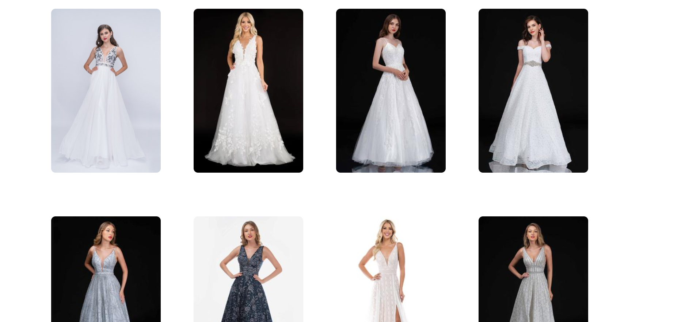

#XGBoost for ranking dresses based on user preferences

1. Features of dress' are preprocessed for accuracy of model.
2. Label of 1 for each dress liked by user and label of 0 for each dress not liked is created.
3. A XGBoost ranker with pairwise ranking is fit to this label (qid here is the above mentioned label)
4. All dresses are ranked on the user category.

